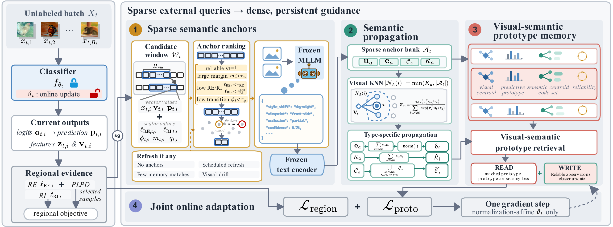

<div id="top" align="center">

# Sparse MLLM Anchors, Dense Adaptation: Breaking the Self-Referential Loop in Wild Test-Time Adaptation
  
  [](http://arxiv.org/abs/2609.17040)

</div>


[](docs/images/framework.pdf)

Sparse MLLM anchor descriptions are propagated to neighboring samples and stored in a visual-semantic prototype memory to guide normalization-affine adaptation. Click the figure to view the original PDF from the paper.

```text
GTA/
|-- main.py
|-- masa/
|   |-- __init__.py
|   |-- adaptation.py
|   |-- data.py
|   |-- runtime.py
|   `-- semantic_memory.py
|-- assets/
|   |-- cov_resnet50_gn_timm.npy
|   |-- cov_vitbase_timm.npy
|   `-- label_shift_indices.npy
|-- docs/
|   `-- images/
|       |-- framework.png
|       `-- framework.pdf
|-- requirements.txt
`-- README.md
```

## Environment Setup

Clone the repository and enter its root directory:

```bash
git clone https://github.com/wongzbb/GTA.git
cd GTA
```

Pinned dependency versions are listed in `requirements.txt`.

```bash
python -m pip install -r requirements.txt
python main.py --help
```

## Required Local Assets

Datasets and model checkpoints must be provided separately. Supply their paths on the command line:

- `--data_corruption`: ImageNet-C root with
  `<corruption>/<level>/<class>/<image>` layout.
- `--model_checkpoint`: classifier checkpoint in `.safetensors`, `.pth`,
  or `.npz` format.
- `--semantic_mllm_model`: local MLLM directory for semantic description generation.
- `--semantic_text_encoder_checkpoint`: local text-encoder checkpoint.


## Evaluation

Run commands from the repository root. The following command evaluates label shift
with a local Qwen-family backend:

```bash
python main.py \
  --method masa \
  --exp_type label_shifts \
  --model resnet50_gn_timm \
  --data_corruption /path/to/imagenet-c \
  --model_checkpoint /path/to/classifier.safetensors \
  --semantic_mllm_type qwen \
  --semantic_mllm_model /path/to/qwen-model \
  --semantic_text_encoder_checkpoint /path/to/text-encoder.pt \
  --semantic_hash_fallback false \
  --output ./outputs/qwen_label_shift
```

Mixed corruption shift:

```bash
python main.py \
  --method masa \
  --exp_type mix_shifts \
  --model resnet50_gn_timm \
  --data_corruption /path/to/imagenet-c \
  --model_checkpoint /path/to/classifier.safetensors \
  --semantic_mllm_type qwen \
  --semantic_mllm_model /path/to/qwen-model \
  --semantic_text_encoder_checkpoint /path/to/text-encoder.pt \
  --semantic_hash_fallback false \
  --report_topk 1,2 \
  --output ./outputs/qwen_mix_shift
```

Single-sample adaptation with a BLIP-family backend:

```bash
python main.py \
  --method masa \
  --exp_type bs1 \
  --model resnet50_gn_timm \
  --data_corruption /path/to/imagenet-c \
  --model_checkpoint /path/to/classifier.safetensors \
  --semantic_mllm_type blip2 \
  --semantic_mllm_model /path/to/blip-model \
  --semantic_text_encoder_checkpoint /path/to/text-encoder.pt \
  --semantic_hash_fallback false \
  --output ./outputs/blip_bs1
```

`--max_batches 0` runs the complete evaluation. The bundled label-shift index
file is the default ordering for the reported label-shift setting; another
ordering can be supplied with `--label_shift_indices`.
